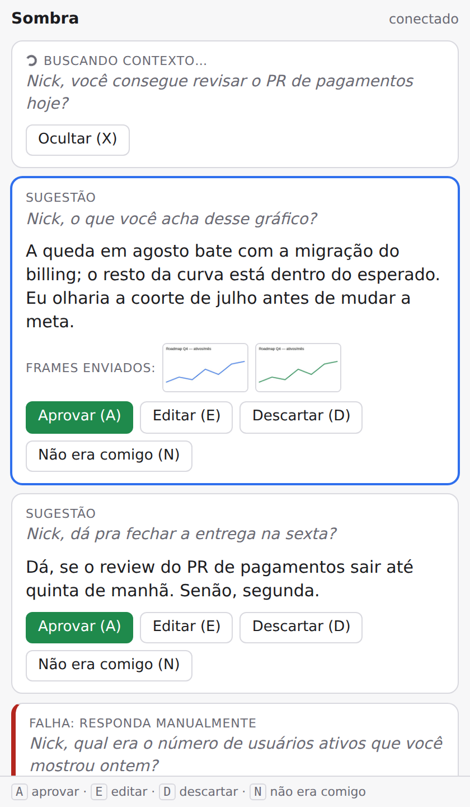

# Approval overlay

The overlay shows each suggestion with the excerpt that fired the trigger and the frames that
were sent to the model, and records your decision. Design: [ADR 0010](adr/0010-ui-local-web-overlay.md).



## Cards (newest on top)

| Card | When | What you can do |
| --- | --- | --- |
| **buscando contexto…** | a trigger fired, the agent is working (also a system notification) | hide it (`X`) |
| **sugestão** | the answer is ready | approve, edit, discard, "não era comigo" |
| **falha: responda manualmente** | the agent failed; the excerpt stays so you can answer yourself (also a system notification) | dismiss (`X`) |

## Keyboard

Shortcuts act on the newest suggestion (the one with the blue border).

| Key | Action | Logged as |
| --- | --- | --- |
| `A` | approve; in text mode the answer is copied to the clipboard | `approve` |
| `E` | open the inline editor; `⌘↵`/`Ctrl+↵` approves the edited text (copied), `Esc` cancels | `edit` (or `approve` if nothing changed) |
| `D` | discard | `discard` |
| `N` | "não era comigo": discard and mark a false trigger | `not_for_me` |
| `X` | hide the newest "buscando" / "falha" card | not logged |

## Try it

```sh
uv sync --extra window     # pywebview, for the always-on-top window
uv run sombra ui-demo      # fake triggers/suggestions; decisions are printed to stdout
uv run sombra ui-demo --browser          # plain browser tab instead of the window
uv run sombra ui-demo --no-open          # just print the URL (with its token)
```

Flags: `--interval S` between suggestions, `--think S` in "buscando contexto…",
`--rounds N`, `--no-clipboard`.

## macOS permissions

- **Notifications**: the first notification comes from "Script Editor" (`osascript`); allow it
  in System Settings → Notifications.
- No other permission is needed: the window is a normal app window at status-bar level.

## Security

The server listens on `127.0.0.1` only, on a random port, and rejects any request without the
session token or with a foreign `Host`/`Origin`. Meeting text is shown as plain text, never as HTML.
